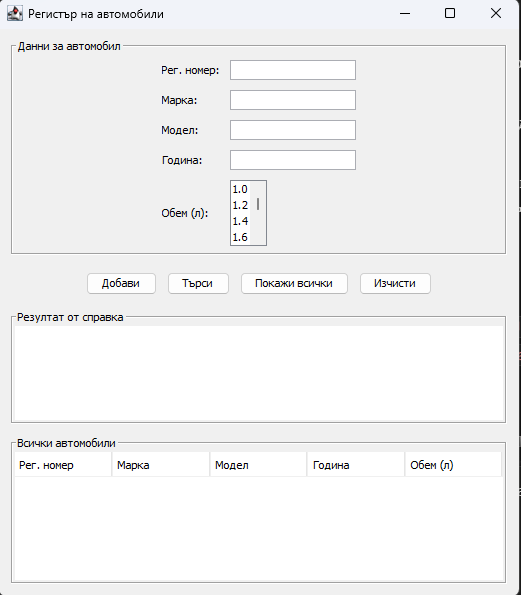
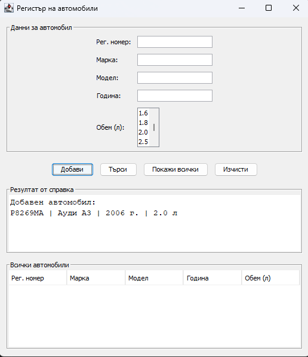
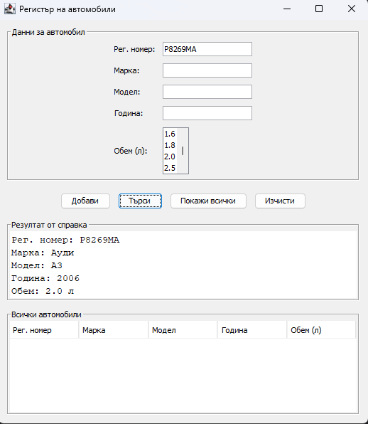
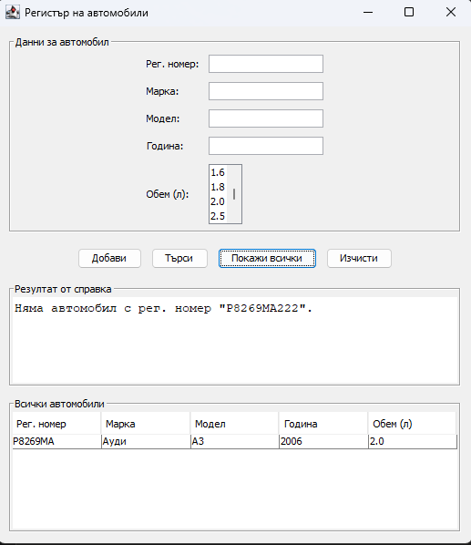

# 🚗 Регистър на автомобили

> Настолно приложение на **Java Swing** за въвеждане, съхранение и справки за автомобили.
> Курсова задача по дисциплината *Програмни езици* — вариант 113.

<p align="center">
  
  
  
  
</p>

---

## 📋 Съдържание

- [Описание](#-описание)
- [Функционалности](#-функционалности)
- [Екранни снимки](#-екранни-снимки)
- [Структура на проекта](#-структура-на-проекта)
- [Компилиране и стартиране](#-компилиране-и-стартиране)
- [Как работи](#-как-работи)
- [Използвани технологии](#-използвани-технологии)
- [Лиценз](#-лиценз)

---

## 📖 Описание

Приложението представлява прост регистър на автомобили с графичен потребителски
интерфейс. Всеки автомобил се описва с пет атрибута:

| Атрибут | Тип | Въвеждане |
|---|---|---|
| **Рег. номер** 🔑 | текст | текстово поле *(ключово поле за търсене)* |
| Марка | текст | текстово поле |
| Модел | текст | текстово поле |
| Година на регистрация | цяло число | текстово поле |
| Обем на двигателя | реално число | избор от списък (`JList`) |

Данните се съхраняват в **масив** по време на работа на програмата, а справките
се извършват по ключовото поле — регистрационния номер.

---

## ✨ Функционалности

- ➕ **Добавяне** на автомобил с валидация на входните данни
- 🔍 **Търсене** по регистрационен номер (без чувствителност към главни/малки букви)
- 📋 **Преглед** на всички въведени автомобили в таблица
- 🧹 **Изчистване** на полетата с едно натискане
- ⚠️ **Съобщения** при непопълнени или невалидни данни
- 📈 **Динамичен масив** — капацитетът се удвоява автоматично при запълване

---

## 📸 Екранни снимки

<table>
  <tr>
    <td width="50%">
      
      <p align="center"><em>Начален изглед на приложението</em></p>
    </td>
    <td width="50%">
      
      <p align="center"><em>Успешно добавен автомобил</em></p>
    </td>
  </tr>
  <tr>
    <td width="50%">
      
      <p align="center"><em>Справка по регистрационен номер</em></p>
    </td>
    <td width="50%">
      
      <p align="center"><em>Преглед на всички автомобили</em></p>
    </td>
  </tr>
</table>

---

## 📁 Структура на проекта

```
.
├── src/
│   ├── Car.java        # Клас-модел: описва един автомобил
│   ├── CarApp.java     # Главен прозорец (JFrame) + логика
│   └── Main.java       # Входна точка на приложението
├── screenshots/        # Екранни снимки за документацията
└── README.md
```

Приложението е разделено на три класа според отговорностите:

- **`Car`** — модел на данните: петте атрибута, get-методи и `toString()`.
- **`CarApp`** — наследник на `JFrame`; изгражда интерфейса и съдържа логиката
  за добавяне и търсене.
- **`Main`** — стартов клас с метода `main`.

---

## 🚀 Компилиране и стартиране

Необходим е инсталиран **JDK 8** или по-нов.

```bash
# Компилиране
javac src/*.java -d out

# Стартиране
java -cp out Main
```

Или, ако файловете са в една папка:

```bash
javac Car.java CarApp.java Main.java
java Main
```

---

## ⚙️ Как работи

### Съхранение в масив

Данните се пазят в масив от обекти `Car` с начален капацитет 10. При запълване
се създава нов масив с двоен размер, а елементите се прехвърлят в него — така се
спазва изискването за масив, но без ограничение в броя записи.

```java
if (count == cars.length) {
    Car[] bigger = new Car[cars.length * 2];
    for (int i = 0; i < cars.length; i++) {
        bigger[i] = cars[i];
    }
    cars = bigger;
}
```

### Търсене по ключово поле

Търсенето обхожда масива и сравнява регистрационните номера. Използва се
`equalsIgnoreCase`, за да не се различават главни и малки букви.

```java
for (int i = 0; i < count; i++) {
    if (cars[i].getRegNumber().equalsIgnoreCase(reg)) {
        found = cars[i];
        break;
    }
}
```

---

## 🛠 Използвани технологии

- **Java SE** — език за програмиране
- **Swing** (`javax.swing`) — графичен потребителски интерфейс
- **AWT** (`java.awt`) — мениджъри за разположение на компонентите

Не са използвани външни библиотеки — проектът се компилира само със стандартния JDK.

---

## 📄 Лиценз

Разпространява се под лиценз MIT. Свободно за учебни цели.

---

<p align="center">
  Разработено като курсова задача · КСТ, Русенски университет
</p>
